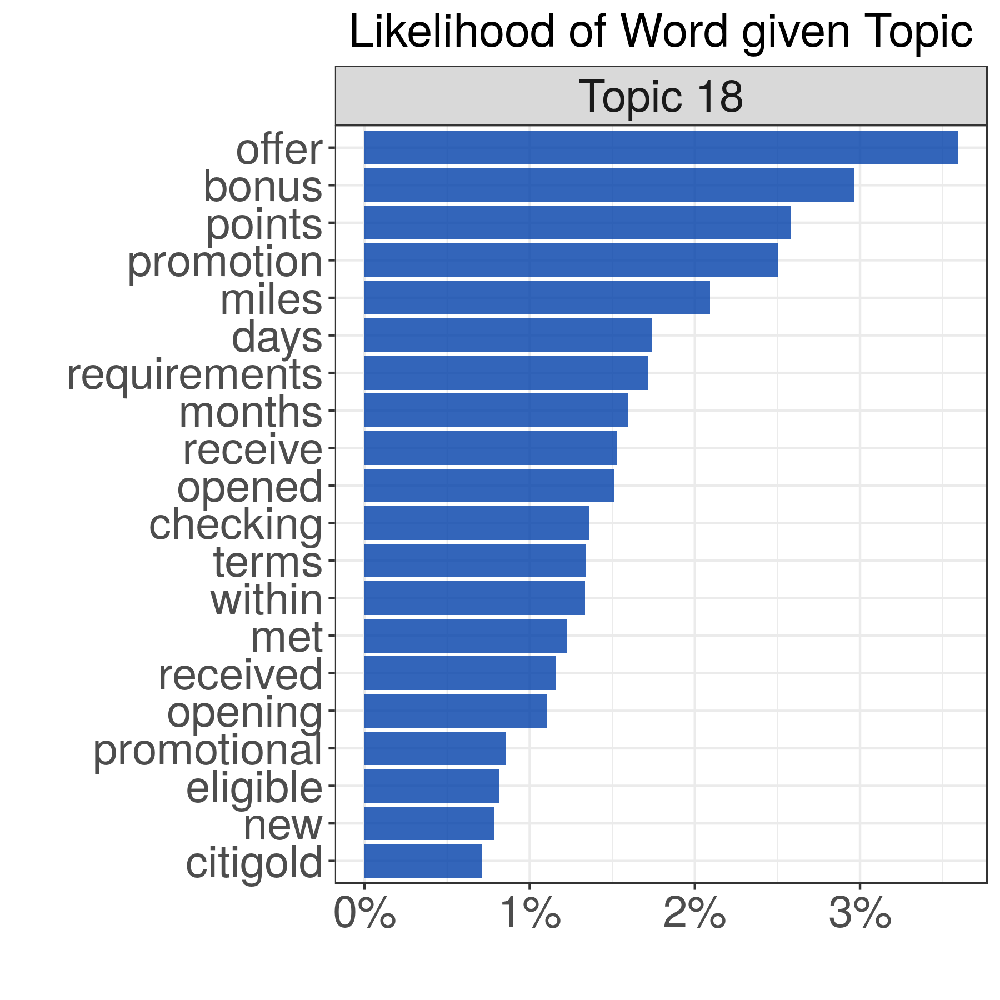
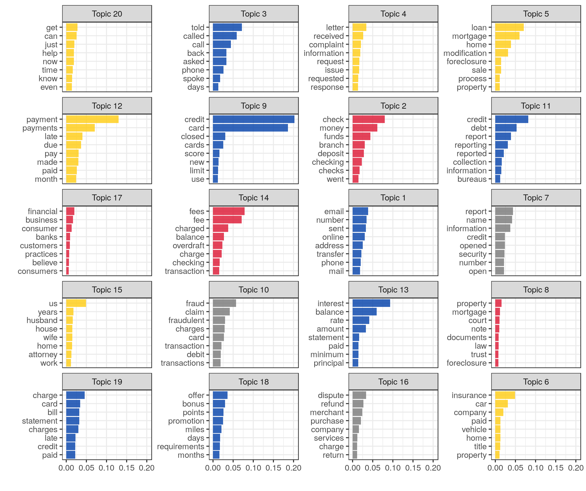

```{r xaringan-themer, include = FALSE}
library(xaringanthemer); library(tidyverse)
mono_accent(base_color = "#0051BE")
```

```{r setup, include=FALSE}
options(htmltools.dir.version = FALSE)
```

# Agenda

### About Me: 5 min

### My Research: 10 min

### Topic Modeling to Analyze CFPB Complaints: 30 min

### Discussion & Questions: 15 min

---

#### UNC Charlotte PhD Candidate

- Computing & Information Systems (Computer Science)

- UNCC Visualization Center, Pacific Northwest National Laboratory, UNCC Data Science Initiative, Project Mosaic

#### Prior Education

- UNC-Chapel Hill (BA in Econ, 2007), NCSU (MS in Fin Math, 2009), NYU (MA in Econ, 2011)

#### BofA (2009-2014) / Hawkeye (2014-2015)

- Credit Risk and Marketing Analytics and Strategy

- GRMAP, Small Business Credit Risk, Auto/DFS Scorecard Modeling

#### Teaching & R/R Studio enthusiast

- Taught UNCC workshops <a href="https://github.com/wesslen" target="_blank">(GitHub)</a> in R for text, social media, data viz.

- Tentatively teaching master's Visual Analytics course for UNCC DSI in Spring 2019

---

class: center, middle

# My Research


---

## Event Detection in Social Media

<div align="center">

</div>

<a href="https://www.researchgate.net/profile/Isaac_Cho/publication/324598122_CrystalBall_A_Visual_Analytic_System_for_Future_Event_Discovery_and_Analysis_from_Social_Media_Data/links/5ad7bd1f458515c60f588bb8/CrystalBall-A-Visual-Analytic-System-for-Future-Event-Discovery-and-Analysis-from-Social-Media-Data.pdf" target="_blank">CrystalBall Paper</a>

---

## Identifying Misinformation using Visual Analytics
<div align="center">
  <video width="620" height="480" controls>
    <source src="./img/verifi.mp4" type="video/mp4">
  </video>
</div>

<a href="https://aaai.org/ocs/index.php/ICWSM/ICWSM18/paper/view/17853" target="_blank">ICWSM Paper</a>

---

## Explainable AI / Interpretable ML

<div align="center">

</div>

Source: <a href="https://www.darpa.mil/program/explainable-artificial-intelligence" target="_blank">DARPA XAI</a>

---

## Visual Interactive Labeling (CHISSL)

<div align="center">
  <video width="620" height="480" controls>
    <source src="./img/chissl.mp4" type="video/mp4">
  </video>
</div>

Paper under revision <a href="https://github.com/pnnl/chissl/" target="_blank">(GitHub)</a>

---

## Applied Text Analyses

.pull-left[
<div align="center">

</div>

For more technical, see (<a href="https://arxiv.org/abs/1803.11045" target="_blank">"Computer Assisted Text Analysis"</a>) paper
]

.pull-right[

- **Management**: Corporate websites on recruitment content (<a href="http://journals.sagepub.com/doi/abs/10.1177/0149206318764295" target="_blank">MNE Paper</a>)

- **Organizational Science**: Open-ended survey on manager leadership (<a href="https://link.springer.com/article/10.1007/s10869-017-9528-3" target="_blank">TMM Paper</a>, left)

- **Social Psychology**: Twitter profiles (<a href="https://aaai.org/ocs/index.php/ICWSM/ICWSM18/paper/view/17834" target="_blank">Twitter Bumper Sticker</a>)

- **Communications**: Charlotte Protests tweets (next slide)

- I also have text experience with research abstracts, patents, news articles, emails, ...

]

---

<div align="center">

</div>

<a href="(https://wesslen.github.io/assets/documents/presentations/IC2S2-HotIssue-Charlotte.pdf" target="_blank">(IC2S2 2017)</a> Charlotte Protest Presentation

---


class: center, middle

# Text Analysis Methods

```{r echo=FALSE, fig.align='center'}
DiagrammeR::grViz("
digraph G {

node [fontname = Helvetica]
A [label = 'Text Analysis']
B [label = 'Qualitative']
C [label = 'Machine\nLearning']
D [label = 'Natural\nLanguage\nProcessing']
E [label = 'Supervised']
F [label = 'Unsupervised']
G [label = 'Topic\nModeling']

A->B A->C A->D C->E C->F F->G;}")
```

---

class: middle


Source: Pablo Barbera

---

class: middle


[Blei, 2012](http://www.cs.columbia.edu/~blei/papers/Blei2012.pdf)

---

class: center, middle

<div align="center">

</div>

## CFPB Complaint Competitive Analysis


---

.pull-left[
Analyze 46,590 CFPB Complaints with *narratives* between **March 2015** to **August 2018** for BAC, JPM, WFC, and CITI.

<div align="center">

</div>

Use **topic modeling** to identify prevalent themes via unsupervised machine learning.

Exploratory, document summarization technique needing *little assumed knowledge*.

]

.pull-right[

]


---

class: center, middle


---

# Example: Topic 18

<div align="center">

</div>
---

# Topic 18: "Bonus, offer, points, promotion"

```{r echo=FALSE}
DT::datatable(
  read_rds("./data/reps.rds"),
  fillContainer = FALSE, rownames = FALSE, caption = 'Complaints ranked by Topic Probability for Topic 18',
  options=list(
    dom = "tip",
    pageLength = 5,
  initComplete = DT::JS(
        "function(settings, json) {",
        "$(this.api().table()).css({'font-size': '80%', 'background-color': '#fff', 'color': '#000'});",
        "}"))
) 
```
---

class: center, middle



---

class: center, middle


[Structural topic modeling](http://www.structuraltopicmodel.com/)

---

class: center, middle


---

class: center, middle

# Questions & Discussion: Thanks!

[github.com/wesslen](https://github.com/wesslen)

[wesslen.github.io](https://wesslen.github.io)

[CFPB GitHub Code](https://github.com/wesslen/nlp-talk)

---

class: center, middle


